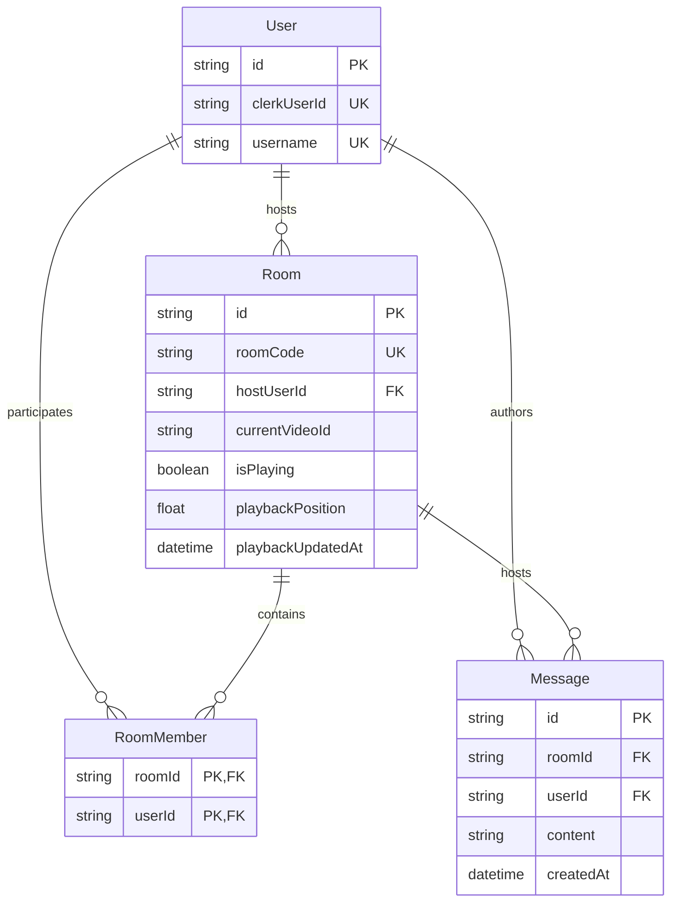

# SyncD — System Architecture

> Concise guide to SyncD's system architecture, technical conventions, and real-time protocols.  
> The codebase is the authoritative source of truth.

---

## 1. System Topology

SyncD is a full-stack TypeScript application for synchronized social music-listening via YouTube.

```mermaid
graph TB
    subgraph Client [Client (React 19 SPA + Vite)]
        UI[UI & Pages]
        Player[YouTube IFrame Player]
        SocketClient[Socket.IO Client]
        ClerkClient[Clerk Auth SDK]
    end

    subgraph Server [Backend (Node.js / Express)]
        REST[Express REST API]
        AuthMW[Clerk Auth Middleware]
        SocketServer[Socket.IO Gateway]
        PresenceStore[(In-Memory Presence)]
        DomainServices[Domain Services]
    end

    subgraph External [External Services]
        Clerk[Clerk Auth]
        YTAPI[YouTube Data API v3]
        DB[(Neon PostgreSQL / Prisma)]
    end

    ClerkClient <-->|Session JWT| Clerk
    UI -->|REST + Bearer Token| REST --> AuthMW --> DomainServices
    SocketClient <-->|WebSocket + JWT Handshake| SocketServer
    SocketServer <--> PresenceStore
    SocketServer --> DomainServices
    DomainServices --> DB
    DomainServices -->|Search Proxy| YTAPI
    Player <-->|Embed Stream| UI
```

---

## 2. Technology Stack & Directory Layout

| Layer | Technologies | Responsibilities |
| :--- | :--- | :--- |
| **Frontend** | React 19, Vite, Tailwind CSS v4, React Router 7 | UI, local IFrame player control, client-side drift correction, optimistic cached session (`CurrentUserProvider`). |
| **Backend** | Node.js, Express, TypeScript, Socket.IO v4 | REST API, WebSocket gateway, server-authoritative playback state, presence store, YouTube API proxy. |
| **Database** | PostgreSQL (Neon Serverless), Prisma ORM | Persistent storage for users, rooms, memberships, and chat history. |
| **Auth** | Clerk | Identity, OAuth, session JWT issuance and server verification. |

### Monorepo Structure

```text
SyncD/
├── client/src/
│   ├── components/    # Feature modules (YouTubePlayer, ChatPanel, MusicSearch) & UI atoms
│   ├── hooks/         # useRoomSocket, useYouTubePlayer, useCurrentUser
│   ├── pages/         # Landing, Home, Room, Onboarding, RootGuard
│   ├── providers/     # CurrentUserProvider (cached /me session context)
│   └── services/      # Typed API client (api.ts, types.ts)
└── server/src/
    ├── middleware/    # requireAuth (Clerk JWT verify -> DB user attachment)
    ├── modules/       # Domain modules (users, rooms, music, playback, messages)
    │   └── [domain]/  # *.routes.ts -> *.controller.ts -> *.service.ts -> *.validation.ts
    ├── sockets/       # index.ts (event handlers), presenceStore/queueStore/hostTransfer
    │                  #   (in-memory tracking), roomBroadcast.ts (shared emit helpers)
    └── prisma/        # schema.prisma (Neon PostgreSQL schema)
```

---

## 3. Core Architectural Invariants

1. **Server-Authoritative State:** The `Room` row in PostgreSQL is the single source of truth for playback (`isPlaying`, `playbackPosition`, `playbackUpdatedAt`). Clients never dictate state directly to peers.
2. **Zero-Trust Client Identity:** Identity and roles are cryptographically derived from Clerk JWTs on every REST request and socket handshake. Client-sent `userId` or host flags are ignored.
3. **Host-Only Playback & Queue Control:** Only `room.hostUserId` may mutate playback (`playback:set`, `playback:control`, `playback:clear`), the queue (`queue:add`, `queue:remove`, `queue:reorder`, `queue:advance`, `queue:clear`), or the host role itself (`host:transfer`). Enforced server-side via `assertHost`, which re-reads `hostUserId` from PostgreSQL on every event — so a host transfer takes effect immediately with no cached role to invalidate.
4. **Ephemerality vs. Persistence:**
   - **PostgreSQL / Prisma:** Persistent records (`User`, `Room`, `RoomMember`, `Message`).
   - **Socket.IO Memory (`PresenceStore`):** Live connections and multi-tab socket sets. Online/offline state is never written to PostgreSQL.
   - **Socket.IO Memory (`QueueStore`):** Per-room ordered queue. Ephemeral by design — cleared on server restart. No schema change required.
5. **Session Cache:** `/me` is fetched once per session via `CurrentUserProvider`, never refetched on each route guard.
6. **Dynamic Host:** `room.hostUserId` is mutable for the life of the room. Clients never hold it as a constant — it rides on every `presence:update`, so the REST room payload is only a seed value until the first snapshot arrives.

---

## 4. Real-Time Synchronization Protocol

### 4.1 Playhead Calculation
Clients compute live track time locally without polling:

$$\text{CurrentPosition} = \text{playbackPosition} + \begin{cases} (\text{ServerNow} - \text{playbackUpdatedAt}), & \text{if } \text{isPlaying} = \text{true} \\ 0, & \text{if } \text{isPlaying} = \text{false} \end{cases}$$

### 4.2 Drift Correction & Echo Suppression
- **Drift Loop (every 5s):** If $|\text{playerCurrentTime} - \text{derivedServerTime}| > 2.0\text{s}$, execute silent `seekTo()`.
- **Echo Suppression:** When applying a remote `playback:update`, local player event listeners are suppressed (`suppressLocalEventsUntil`) to prevent re-broadcasting the action.

---

## 5. Real-Time Presence (`PresenceStore`)

Tracked in-memory via `Map<roomCode, RoomPresence>`:
- `socketsByUserId: Map<userId, Set<socketId>>` handles multi-tab browsing without duplicate presence entries.
- User is online if their socket set `size > 0`.
- Handshake carries Clerk JWT; `room:join` validates DB membership before admitting socket into `room:<roomCode>`.

---

## 5.5. Queue (`QueueStore`)

Tracked in-memory via `Map<roomCode, QueueItem[]>`, following the same ephemeral pattern as `PresenceStore`:
- Each `QueueItem` carries `{ videoId, title, thumbnailUrl, duration }` — the same shape as a `PlaybackTrackInput`.
- Maximum 50 items per room (enforced in `enqueue`).
- Queue state survives host socket reconnects (store is keyed by `roomCode`, not `socketId`).
- Queue is cleared when `playback:clear` fires (atomic with stopping the player) or when `queue:clear` / `queue:advance` (empty) is received.
- Full queue snapshot is included in the `room:join` ack, so late joiners receive it in the same round-trip as presence, playback, and chat history.
- **Auto-advance flow:** host client detects `ended` state → emits `queue:advance` → server calls `setRoomTrack` (or `clearRoomTrack`) → broadcasts `playback:update` + `queue:update` to the room.

---

## 5.6. Host Transfer (`hostTransfer.ts` / `roomBroadcast.ts`)

`room.hostUserId` is the only host record; Phase 9 adds the paths that change it.

- **Automatic (disconnect):** when the host's *last* socket for a room drops, a 30 s grace timer is armed in `HostTransferStore` (`Map<roomCode, Timeout>` — same ephemeral pattern as `PresenceStore`/`QueueStore`) and `host:pending` is broadcast with the deadline. A host who reconnects inside the window cancels it via `room:join`. On expiry, everything is **re-validated** (host still offline? successor still a member and online?) before the write.
- **Manual:** the host emits `host:transfer` with a target `userId`, verified against `RoomMember` server-side.
- **Deliberate leave:** `POST /rooms/:roomCode/leave` by the host hands over immediately — no grace period. The room is deleted only if the host was the last member.
- **Successor rule:** the longest-standing *online* member. `getRoomMembersForPresence` returns members `orderBy joinedAt: "asc"`, so the first online entry wins.
- **Concurrency guard:** the write is always `updateMany({ where: { id, hostUserId: expectedHostUserId } })`. A timer firing can race a manual transfer or a host leaving; the `where` clause lets exactly one win, and losers abort silently.
- **`roomBroadcast.ts`** holds the module-level `io` handle so the REST leave path can emit presence and host events without threading `io` through Express.

Playback and queue need no special handling: the queue is keyed by `roomCode`, and the new host's client immediately owns the `ended → queue:advance` auto-advance.

---

## 6. Database Schema (Prisma)



---

## 7. API & Event Dictionary

### REST Endpoints

| Endpoint | Method | Purpose |
| :--- | :--- | :--- |
| `/api/me` | `GET` | Get current user profile & onboarding status. |
| `/api/users/profile` | `POST` | Complete onboarding with unique username. |
| `/api/rooms` | `POST` | Create room (assigns creator as host & member). |
| `/api/rooms/:roomCode` | `GET` | Get room metadata & verify membership. |
| `/api/rooms/:roomCode/join` | `POST` | Add user to persistent `RoomMember`. |
| `/api/rooms/:roomCode/leave`| `POST` | Remove user from `RoomMember`. A departing host hands the room to the longest-standing remaining member; the room is deleted only if they were the last member. |
| `/api/music/search` | `GET` | Proxied YouTube Data API v3 search (`?q=`). |
| `/api/music/video` | `GET` | Resolve direct YouTube URL metadata (`?url=`). |

### Socket.IO Events

| Event | Direction | Scope / Auth | Description |
| :--- | :--- | :--- | :--- |
| `room:join` | Client $\to$ Server | Member | Joins room channel. Ack returns presence (incl. host), playback, last 50 messages, and queue snapshot. Also cancels a pending host transfer if the returning user is the host. |
| `presence:update` | Server $\to$ Room | Broadcast | Live member roster **and the authoritative `hostUserId`**. |
| `playback:set` | Client $\to$ Server | Host Only | Sets new track, persists to DB, broadcasts update. |
| `playback:control` | Client $\to$ Server | Host Only | Play/pause/seek, persists to DB, broadcasts update. |
| `playback:clear` | Client $\to$ Server | Host Only | Clears current track **and queue**, persists to DB, broadcasts update. |
| `playback:update` | Server $\to$ Room | Broadcast | Authoritative playhead & state snapshot. |
| `chat:send` | Client $\to$ Server | Member | Validates (max 500 chars), persists to DB, broadcasts. |
| `chat:new` | Server $\to$ Room | Broadcast | New message delivery. |
| `queue:add` | Client $\to$ Server | Host Only | Appends a track to the in-memory queue; broadcasts `queue:update`. |
| `queue:remove` | Client $\to$ Server | Host Only | Removes item at index; broadcasts `queue:update`. |
| `queue:reorder` | Client $\to$ Server | Host Only | Moves item fromIndex → toIndex; broadcasts `queue:update`. |
| `queue:advance` | Client $\to$ Server | Host Only | Pops front item, sets as current track (or clears if empty); broadcasts `playback:update` + `queue:update`. |
| `queue:clear` | Client $\to$ Server | Host Only | Empties the queue; broadcasts `queue:update`. |
| `queue:update` | Server $\to$ Room | Broadcast | Authoritative ordered queue snapshot. |
| `host:transfer` | Client $\to$ Server | Host Only | Promotes a room member to host. Target validated against `RoomMember`. |
| `host:update` | Server $\to$ Room | Broadcast | The host changed, with `reason: "manual" \| "disconnect" \| "left"`. |
| `host:pending` | Server $\to$ Room | Broadcast | The host's connection dropped; carries the deadline the automatic transfer fires at, or `pending: false` when the countdown is retired. |