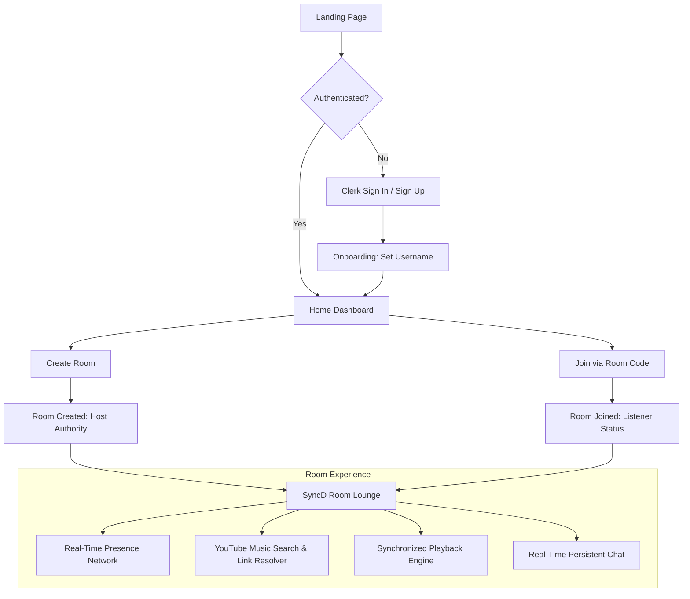

# SyncD — Product Requirements Document (PRD)

**Document Version:** 1.0.0  
**Product Stage:** Active Development (Phases 1–7 Implemented)  
**Author:** SyncD Core Engineering & Product Team  
**Last Updated:** September 2026  
**Status:** Approved & Living Document  

---

## 1. Executive Summary

### 1.1 Product Vision
**SyncD** is a lightweight, zero-friction, social music-listening web application designed to bring people together through sound. It enables groups of friends, remote co-workers, and online communities to hang out in virtual rooms, search and stream music from YouTube, keep playback synchronized to the sub-second, and converse via real-time chat—all within a modern browser window without mandatory downloads, accounts on third-party music services, or paid subscriptions.

### 1.2 Core Value Proposition
> *"Create a room, invite your people, press play."*

Traditional solutions for shared listening suffer from significant barriers:
- **Spotify Group Sessions** requires every listener to have an active Spotify Premium subscription.
- **Discord Music Bots** have been systematically deprecated, suffer from complex slash-command UX, and disrupt natural conversation.
- **Video Conferencing (Zoom/Google Meet)** aggressively compresses audio, filters music through noise-cancellation algorithms, and consumes excessive bandwidth.

SyncD bridges this gap with an ultra-lightweight, browser-native listening lounge powered by the world's most accessible open music catalog: YouTube.

---

## 2. Target Personas & Use Cases

### 2.1 User Personas

| Persona | Archetype | Needs & Pain Points | Primary Actions |
| :--- | :--- | :--- | :--- |
| **Arjun (22)** | *The Room Host & Music Curator* | Wants to share obscure indie tracks and synthwave playlists with friends across cities without forcing everyone to download software or buy subscriptions. | Creates room, searches YouTube or pastes links, controls playback, curates the vibe. |
| **Sarah (20)** | *The Casual Mobile Listener* | Joins between classes or while working. Often on cellular data or mobile browser. Needs quick joining and automatic playback synchronization. | Opens invite link/code, syncs instantly, drops reactions/chat messages, leaves seamlessly. |
| **Dev (25)** | *The Remote Study/Work Comrade* | Wants ambient lo-fi beats with coworkers while coding in silence. Dislikes intrusive voice calls but enjoys presence awareness. | Leaves tab open in background, relies on automatic drift correction and live presence indicator. |

### 2.2 Core Use Cases
1. **Remote Hangouts & Parties:** Friends listening to curated albums, party bangers, and watching music videos together while chatting.
2. **Co-working & Study Lounges:** Focused groups listening to lo-fi, instrumental, or classical tracks with minimal distraction.
3. **Music Discovery Sessions:** One person playing newly found tracks to a group of friends for real-time reactions and commentary.

---

## 3. Product Principles & Architecture Constraints

1. **Server-Authoritative Synchronization:**  
   The server is the sole arbiter of time and playback state. Clients never command peers directly; all mutations route through the backend, update persistent storage, and broadcast state snapshots.
2. **Zero-Trust Client Identity:**  
   Client-provided `userId`, `hostStatus`, or room permissions are never trusted. All identity is cryptographically derived via Clerk JWT verification on every REST request and Socket.IO handshake.
3. **Graceful Degradation & Healing:**  
   Network disconnects, backgrounded browser tabs, and clock drift are treated as normal states. The client must continuously self-heal to match the room state without requiring full page reloads.
4. **Ephemerality vs. Persistence Separation:**  
   - **PostgreSQL (Neon / Prisma):** Persistent records (Users, Rooms, Memberships, Chat Messages).
   - **Socket.IO (In-Memory):** Ephemeral state (Active socket presence, typing indicators, temporary connection metadata).

---

## 4. User Journey & Core Product Flow



### 4.1 Detailed Flow Steps
1. **Landing & Discovery:** Visitor lands on a high-aesthetic, dark-mode landing page detailing key features and dynamic preview visuals.
2. **Authentication:** User signs in via Google OAuth or Email Magic Link managed by Clerk.
3. **Onboarding Check:** If new user, routes to `/onboarding` to claim a unique alphanumeric username. Cached via shared `CurrentUserProvider`.
4. **Dashboard / Home:** User chooses to **Create Room** (generates human-friendly 6-character code) or **Join Room** (inputs 6-character code).
5. **Room Lounge Entry:**
   - Client establishes authenticated WebSocket handshake with backend.
   - Initial state payload arrives: Active presence list, Authoritative playback snapshot, and 50 most recent chat messages.
   - YouTube IFrame initializes silently, ready for playback commands.
6. **Shared Listening & Social Interaction:**
   - Host searches music or pastes links; playback changes for everyone in <300ms.
   - Participants chat, view member avatars, and stay locked in sync.

---

## 5. Functional Requirements & Feature Specifications

### 5.1 Authentication & Identity Management
- **FR-AUTH-01:** System must support Google OAuth and Email-based Magic Links via Clerk.
- **FR-AUTH-02:** Backend must verify Clerk session tokens via `@clerk/backend` on all protected endpoints (`/api/me`, `/api/rooms/*`, `/api/music/*`) and WebSocket handshakes.
- **FR-AUTH-03:** Users must have a unique, lowercase alphanumeric username (3–20 characters, matching `^[a-zA-Z0-9_]{3,20}$`).
- **FR-AUTH-04:** First-time users without a completed profile must be automatically routed to Onboarding; existing profiles must skip directly to Home.

### 5.2 Room Lifecycle & Membership
- **FR-ROOM-01:** Room codes must be 6-character, human-readable, unique alphanumeric strings excluding ambiguous characters (e.g., `O`, `0`, `I`, `1`).
- **FR-ROOM-02:** Room creator is immediately designated as `hostUserId` and added to `RoomMember`.
- **FR-ROOM-03:** Room members must be persisted in PostgreSQL table `room_members` to record historical room participation.
- **FR-ROOM-04:** Users may leave a room explicitly via `POST /api/rooms/:roomCode/leave`, which removes persistent membership.
- **FR-ROOM-05:** Host permissions are strictly enforced: Only the member matching `room.hostUserId` can trigger playback controls, track changes, or track removals.

### 5.3 Real-Time Presence & Socket Handshake
- **FR-PRES-01:** WebSocket connections must authenticate during the handshake using Clerk JWT (`socket.handshake.auth.token`).
- **FR-PRES-02:** When joining a room, user emits `room:join` with `{ roomCode }`. Server verifies user membership in DB before admitting socket into room room channel (`room:<roomCode>`).
- **FR-PRES-03:** Ephemeral presence tracks multi-tab connections per user without duplicating user avatars in the UI.
- **FR-PRES-04:** When a user disconnects the last active socket tab, a delayed leave/disconnect is processed to prevent rapid jitter during page refreshes.

### 5.4 Music Discovery & Video Resolution
- **FR-MUS-01 (Search):** Backend exposes `GET /api/music/search?q=<query>`, querying YouTube Data API v3 (`videoCategoryId=10` for Music). API key remains strictly server-side.
- **FR-MUS-02 (Link Resolver):** Backend exposes `GET /api/music/video?url=<url>`, resolving direct YouTube URLs:
  - Standard watch URLs: `https://www.youtube.com/watch?v=...`
  - Shortened URLs: `https://youtu.be/...`
  - Embed URLs: `https://www.youtube.com/embed/...`
  - Shorts URLs: `https://www.youtube.com/shorts/...`
  - Raw 11-character video IDs.
- **FR-MUS-03 (Validation):** Resolvers verify that the video allows external IFrame embedding and is not region-blocked.

### 5.5 Server-Authoritative Playback Synchronization Engine
- **FR-SYNC-01 (State Storage):** Room table persists playback snapshot:
  - `currentVideoId` (String)
  - `currentTitle` (String)
  - `currentThumbnailUrl` (String)
  - `currentDuration` (Float, seconds)
  - `isPlaying` (Boolean)
  - `playbackPosition` (Float, seconds)
  - `playbackUpdatedAt` (Timestamp with timezone)
  - `playbackUpdatedById` (User ID)
- **FR-SYNC-02 (Deriving Current Position):** Clients derive the true live playhead without querying the server every second:
  $$\text{CurrentPosition} = \text{playbackPosition} + \begin{cases} (\text{ServerNow} - \text{playbackUpdatedAt}), & \text{if } \text{isPlaying} = \text{true} \\ 0, & \text{if } \text{isPlaying} = \text{false} \end{cases}$$
- **FR-SYNC-03 (Drift Correction):** Client runs an autonomous drift detection loop every 5 seconds:
  - Calculates difference $\Delta = |\text{localPlayerTime} - \text{derivedServerTime}|$.
  - If $\Delta > 2.0\text{ seconds}$, client triggers an automatic silent `player.seekTo(derivedServerTime)`.
  - If $\Delta \le 2.0\text{ seconds}$, playback remains untouched to prevent micro-stutters.
- **FR-SYNC-04 (Echo Prevention):** Client sets an internal execution lock (`suppressLocalEventsUntil`) when applying remote snapshots to prevent the YouTube `onStateChange` listener from re-emitting an action back to the server.

### 5.6 Real-Time Social Chat
- **FR-CHAT-01:** Members emit `chat:send` with `{ roomCode, content }`.
- **FR-CHAT-02 (Validation):** Content must be trimmed, non-empty, and capped at 500 characters.
- **FR-CHAT-03 (Persist-Before-Broadcast):** Server writes the message to PostgreSQL before broadcasting `chat:new` to `room:<roomCode>`. If database write fails, an error ack is returned and no broadcast occurs.
- **FR-CHAT-04 (Initial History):** When joining a room, `room:join` acknowledgment carries the 50 most recent messages ordered chronologically.
- **FR-CHAT-05 (UI Behavior):**
  - Messages auto-scroll to bottom only if user is already within 80px of the bottom.
  - If user is scrolled up, a *"↓ New messages"* pill appears.

---

## 6. Database Schema & Data Models (Prisma / PostgreSQL)

```prisma
model User {
  id          String   @id @default(cuid())
  clerkUserId String   @unique @map("clerk_user_id")
  username    String   @unique
  createdAt   DateTime @default(now()) @map("created_at")
  updatedAt   DateTime @updatedAt @map("updated_at")

  hostedRooms          Room[]       @relation("RoomHost")
  playbackUpdatedRooms Room[]       @relation("RoomPlaybackUpdater")
  memberships          RoomMember[]
  messages             Message[]

  @@map("users")
}

model Room {
  id                  String    @id @default(cuid())
  roomCode            String    @unique @map("room_code")
  hostUserId          String    @map("host_user_id")
  currentVideoId      String?   @map("current_video_id")
  currentTitle        String?   @map("current_title")
  currentThumbnailUrl String?   @map("current_thumbnail_url")
  currentDuration     Float?    @map("current_duration")
  isPlaying           Boolean   @default(false) @map("is_playing")
  playbackPosition    Float     @default(0) @map("playback_position")
  playbackUpdatedAt   DateTime? @map("playback_updated_at")
  playbackUpdatedById String?   @map("playback_updated_by")
  createdAt           DateTime  @default(now()) @map("created_at")
  updatedAt           DateTime  @updatedAt @map("updated_at")

  host              User        @relation("RoomHost", fields: [hostUserId], references: [id], onDelete: Restrict)
  playbackUpdatedBy User?       @relation("RoomPlaybackUpdater", fields: [playbackUpdatedById], references: [id], onDelete: SetNull)
  members           RoomMember[]
  messages          Message[]

  @@index([hostUserId], map: "rooms_host_user_id_idx")
  @@map("rooms")
}

model RoomMember {
  roomId   String   @map("room_id")
  userId   String   @map("user_id")
  joinedAt DateTime @default(now()) @map("joined_at")

  room Room @relation(fields: [roomId], references: [id], onDelete: Cascade)
  user User @relation(fields: [userId], references: [id], onDelete: Cascade)

  @@id([roomId, userId])
  @@index([userId], map: "room_members_user_id_idx")
  @@map("room_members")
}

model Message {
  id        String   @id @default(cuid())
  roomId    String   @map("room_id")
  userId    String   @map("user_id")
  content   String
  createdAt DateTime @default(now()) @map("created_at")

  room Room @relation(fields: [roomId], references: [id], onDelete: Cascade)
  user User @relation(fields: [userId], references: [id], onDelete: Cascade)

  @@index([roomId, createdAt], map: "messages_room_id_created_at_idx")
  @@index([userId], map: "messages_user_id_idx")
  @@map("messages")
}
```

---

## 7. API & Real-Time Event Dictionary

### 7.1 REST Endpoints

| Method | Path | Auth | Purpose | Success Response |
| :--- | :--- | :--- | :--- | :--- |
| `GET` | `/api/me` | Required | Retrieve current user profile & onboarding status | `200 OK` `{ user: UserDTO \| null, onboardingComplete: boolean }` |
| `POST` | `/api/users/profile` | Required | Complete onboarding, assign username | `201 Created` `{ user: UserDTO }` |
| `POST` | `/api/rooms` | Required | Create new room, assign host | `201 Created` `{ room: RoomDTO }` |
| `GET` | `/api/rooms/:roomCode` | Required | Get room details & verify membership | `200 OK` `{ room: RoomDTO, isHost: boolean }` |
| `POST` | `/api/rooms/:roomCode/join` | Required | Validate code, add user to `RoomMember` | `200 OK` `{ room: RoomDTO }` |
| `POST` | `/api/rooms/:roomCode/leave`| Required | Leave room, remove from `RoomMember` | `200 OK` `{ success: true }` |
| `GET` | `/api/music/search` | Required | Search music tracks via YouTube API (`?q=`) | `200 OK` `{ tracks: TrackDTO[] }` |
| `GET` | `/api/music/video` | Required | Resolve pasted YouTube video URL (`?url=`) | `200 OK` `{ track: TrackDTO }` |

### 7.2 Socket.IO Event Matrix

| Event Name | Direction | Payload Shape | Handler Role & Authorization |
| :--- | :--- | :--- | :--- |
| `room:join` | Client $\to$ Server | `{ roomCode: string }` | Verifies DB membership. Adds socket to room. Acknowledges with presence snapshot, playback state, and last 50 chat messages. |
| `presence:update` | Server $\to$ Room | `PresenceSnapshot` | Broadcasts current online user roster when a member connects or leaves. |
| `playback:set` | Client $\to$ Server | `{ roomCode, videoId, title, thumbnailUrl, duration }` | **Host Only.** Loads new track into room and begins playback. Persists to DB, broadcasts `playback:update`. |
| `playback:control`| Client $\to$ Server | `{ roomCode, action: 'play'\|'pause'\|'seek', position }` | **Host Only.** Updates playback state and position. Persists to DB, broadcasts `playback:update`. |
| `playback:clear` | Client $\to$ Server | `{ roomCode }` | **Host Only.** Clears current video. Persists null states to DB, broadcasts `playback:update`. |
| `playback:update` | Server $\to$ Room | `PlaybackSnapshot` | Broadcasts latest authoritative playhead, status, and updater identity to all room members. |
| `chat:send` | Client $\to$ Server | `{ roomCode, content }` | Any verified room member. Validates content, writes to DB, broadcasts `chat:new`. |
| `chat:new` | Server $\to$ Room | `ChatMessageDTO` | Delivers new chat message to all connected room members. |

---

## 8. Non-Functional Requirements (NFRs)

### 8.1 Performance & Latency
- **Sub-Second Sync:** Network synchronization drift between listeners must not exceed $2.0$ seconds under standard broadband conditions.
- **Chat Latency:** Real-time messages must deliver to all peers in the room within $150\text{ms}$ of database commit.
- **Initial Load:** Marketing landing page First Contentful Paint (FCP) $< 1.2\text{s}$, Largest Contentful Paint (LCP) $< 2.0\text{s}$ on standard 4G connections.

### 8.2 Reliability & Fault Tolerance
- **Transient Disconnect Recovery:** Dropped sockets (Wi-Fi flip, sleep mode) must automatically reconnect and reconcile state via `room:join` ack without requiring page reload.
- **Idempotent State Ingestion:** Ingesting out-of-order `chat:new` or `playback:update` packets must not produce duplicate messages or playback glitches.
- **Database Connection Pooling:** Neon serverless PostgreSQL connection pooling configured to support high-concurrency room lookups.

### 8.3 Security & Content Safety
- **Cryptographic Auth Boundaries:** Client cannot bypass host status or forge author identity. User identity is extracted directly from the verified Clerk JWT subject.
- **XSS & Injection Protection:** 
  - All user inputs (usernames, chat content, search queries) sanitized and strictly validated.
  - React's default text escaping strictly used (no `dangerouslySetInnerHTML`).
  - Strict Content Security Policy (CSP) for YouTube IFrame embeds.
- **API Key Confidentiality:** `YOUTUBE_API_KEY` is exclusively consumed server-side and never exposed to the client bundle.

### 8.4 Usability & Accessibility (a11y)
- **Responsive Breakpoints:** Fully optimized across Mobile ($< 640\text{px}$), Tablet ($640\text{px} - 1024\text{px}$), and Desktop ($> 1024\text{px}$).
- **Color Contrast:** Strict adherence to WCAG 2.1 AA standards for high contrast dark-mode typography (Ink `#f5f3f0` on Canvas `#0a0908`).
- **Keyboard Navigability:** Full support for keyboard navigation (Tab navigation, Escape to close search, Enter to send chat).

---

## 9. Technical Stack Overview

| Tier | Technologies / Libraries |
| :--- | :--- |
| **Frontend Core** | React 19, TypeScript, Vite, React Router 7 |
| **Styling & Design System** | Tailwind CSS v4, Custom Theme Tokens, Lucide Icons, Glassmorphism, Custom WebGL/Canvas Shaders (`FloatingLines`) |
| **Media Player** | YouTube IFrame Player API |
| **Backend Runtime** | Node.js, Express, TypeScript |
| **Database & ORM** | PostgreSQL (Neon Serverless), Prisma ORM |
| **Real-Time Communication**| Socket.IO (WebSockets with HTTP Long-Polling fallback) |
| **Authentication** | Clerk (OAuth, Magic Link, Session Tokens, User Management) |
| **External APIs** | YouTube Data API v3 |

---

## 10. Known Edge Cases & Mitigation Strategies

| Edge Case | Failure Mode | Mitigation Strategy |
| :--- | :--- | :--- |
| **Mobile Autoplay Restrictions** | Mobile browsers block programmatic video play without a direct user interaction. | Display an explicit *"Tap to Unmute / Sync"* overlay on mobile devices that triggers a user-gesture playback initiation. |
| **Host Closes Tab / Disconnects** | Room left without an active host to manage tracks. | Playback continues based on last authoritative snapshot. (Future Phase 9 will implement auto-host transfer). |
| **Network Lag Spike ($> 3000\text{ms}$)** | Client playhead lags behind the rest of the room. | Autonomous 5-second drift checker notices drift $>2.0\text{s}$ and immediately reseeks player forward to server-derived timestamp. |
| **YouTube Embed Restricted Video** | Video plays on YouTube but errors in embedded IFrame. | Backend Link Resolver verifies `embeddable: true` and rejects non-embeddable videos before writing to playback state. |
| **Stale Chat History Snapshot** | Reconnection payload might omit a message broadcasted during the brief reconnection race. | Client merges incoming history array with local state by unique `message.id` rather than blindly replacing the array. |

---

## 11. Product Metrics & KPIs

1. **Engagement:**
   - **Average Session Duration (ASD):** Target $> 45\text{ minutes}$ per active listening session.
   - **Synchronized Play Ratio:** Target $> 80\%$ of room time spent in active synchronized playback.
   - **Chat Velocity:** Average messages sent per active room per hour.
2. **Quality of Experience (QoE):**
   - **Sync Accuracy:** 95th percentile of client drift maintained under $1.5\text{ seconds}$.
   - **Socket Reconnection Success:** $> 99\%$ automatic recovery without page refresh.
3. **Virality & Growth:**
   - **Viral Coefficient ($K$-Factor):** Number of invitees joining per created room (Target $K > 1.8$).

---

## 12. Future Roadmap (Phases 8–12)

```mermaid
gantt
    title SyncD Product Evolution Roadmap
    dateFormat  YYYY-MM
    section Completed (MVP)
    Phases 1-4 : Auth, Onboarding, Rooms, Presence :done, 2026-07, 2026-08
    Phases 5-7 : YouTube API, Sync Engine, Chat, Polish :done, 2026-08, 2026-09
    section Upcoming
    Phase 8 : Collaborative Playlist & Shared Queue :active, 2026-10, 2026-11
    Phase 9 : Host Delegation & Dynamic Role Transfer : 2026-11, 2026-12
    Phase 10 : Audio Reactions & Soundboard FX : 2027-01, 2027-02
    Phase 11 : Spotify Connect & SoundCloud Providers : 2027-02, 2027-03
    Phase 12 : Public Lounges & Discovery Feed : 2027-03, 2027-04
```

### Phase 8: Collaborative Room Queue (Immediate Priority)
- Allow room members to propose songs to an interactive shared queue.
- Host configuration toggle: *"Host Only Queue"* vs *"Democratic Queue"*.
- Reordering, voting/upvoting tracks to push them up the queue.

### Phase 9: Host Delegation & Transfer
- Automatic host transfer to the longest-standing active member if the current host disconnects.
- Manual host transfer: Host can promote any room member to Host or DJ.

### Phase 10: Rich Social Audio & Micro-Reactions
- Floating soundboard audio reactions (applause, vinyl scratch, airhorn, bass drop).
- Synchronized waveform visualizer celebrating beats and track transitions.

### Phase 11: Multi-Provider Expansion
- Integration with SoundCloud API and Spotify Web Playback SDK for Spotify Premium users.

### Phase 12: Public Lounges & Communities
- Public lobby list with live genres (e.g., "Lofi Cafe", "Synthwave Highways", "Indie Discovery").
- Tag-based room discovery with listener counts.
